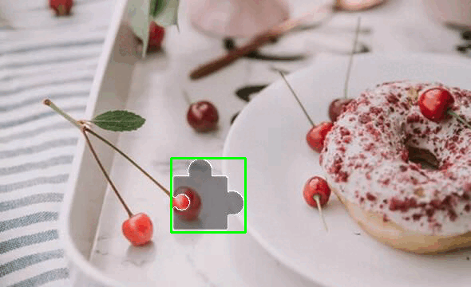

# Silder Captcha Recognition Helper for [Cea][cea]

No need for the original image, `@ceajs/slider-captch` will get the slider target position by processing the slider background image [status: WIP]

# Demo



# Recognition Trustworthiness

Playwright test result(Tested by simulating the unified login of [hqu University][hqu]):

```bash
> npx playwright test

Running 1000 tests using 4 workers
  ...
  858 passed (21m)
```

[cea]: https://github.com/ceajs/cea/issues/25
[hqu]: https://hqu.campusphere.net/portal/login
